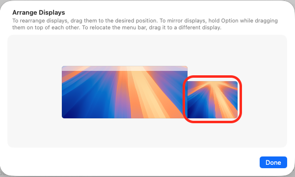

# Overview

This project lets you **dynamically resize and center Mac windows to a chosen proportion of your screen**, adapting automatically to any display size. I use it to neatly center windows on my ultrawide monitor.

This implementation uses:
- **AppleScript** for the core script.
- **Automator** to create a Quick Action.
- **System Settings** keyboard shortcuts for quick access.

# Limitations
- **1 or 2 displays only** – currently supports up to 2 monitors.
- **Second display must be bottom-right aligned** – the secondary monitor must be aligned to the bottom-right of the primary display.
  - Configure this in System Settings → Displays → Arrange. Ensure the secondary monitor's bottom edge aligns with the primary display's bottom edge, as shown below.
  
  

# Configuration

Two parameters control the window size (both are decimal numbers between 0 and 1):
1. **`wPercentage`** – width percentage of the display (default: `0.65`).
2. **`hPercentage`** – height percentage of the display (default: `0.5`).

# Setup

## 1. Install Automator Quick Action

**Option A: Use default configuration**
1. Double-click `center_wide_resize.workflow` to open with Automator Installer.
2. Click Install.

**Option B: Customize configuration**
1. Right-click `center_wide_resize.workflow` and select "Open with Automator" (not Automator Installer).
2. Modify `wPercentage` or `hPercentage` to your desired values.
3. Save the document (this automatically installs the Quick Action).
4. Optional: To rename from the default "Center Focus Resize", use "Save As" (⌥⇧⌘S) with your desired name.

**Note:** To create multiple shortcuts with different configurations, repeat Option B and save each with a unique name.

## 2. Add Keyboard Shortcuts
1. Open System Settings → Keyboard → Keyboard Shortcuts... → Services.
2. Expand "General" and find your Quick Action.
3. Click "none" and enter your desired keyboard shortcut (I use ⌃⌥ + number keys for multiple resize shortcuts).

## 3. Add Accessibility Permissions for WorkflowServiceRunner
1. Open System Settings → Privacy & Security → Accessibility.
2. Click the `+` button.
3. Press ⇧⌘G to open the file path dialog.
4. Enter this path:
   ```
   /System/Library/Frameworks/AppKit.framework/Versions/C/XPCServices/WorkflowServiceRunner.xpc/Contents/MacOS/WorkflowServiceRunner
   ```
5. Press Return and ensure the toggle is turned on.

**Optional:** While here, you can add all apps you want to control with the Quick Action to avoid doing it later (see step 4).

## 4. Enable Permissions for Each App

MacOS requires you to grant permissions for each app you want to resize. The first time you use the shortcut on an app, you will get the following prompts:

1. **Control permission prompt:**
   ```
   "[Your App].app" wants access to control "System Events.app". 
   Allowing control will provide access to documents and data in "System Events.app", 
   and to perform actions within that app.
   ```
   Click "Allow".

2. **Accessibility permission prompt:**
   ```
   "[Your App].app" would like to control this computer using accessibility features. 
   Grant access to this application in Privacy & Security Settings, located in System Settings.
   ```
   Click "Open System Settings" and turn the toggle on for your app.

   You may also see this error (safe to ignore):
   ```
   The action "Run AppleScript" encountered an error: "System Events got an error: 
   Automator Workflow Runner (WorkflowServiceRunner, Center Half Resize) is not allowed assistive access."
   ```
   This error will disappear once you grant accessibility permissions.

## 5. Confirm It Works
After enabling all permissions, trigger the keyboard shortcut again to verify it works correctly.

# Notes
- **Script source:** The AppleScript code can be reviewed by right-clicking `center_wide_resize.workflow` and opening with Automator, or in the standalone `resize_window.scpt` file (included for reference).
- **Quick Action location:** Automator installs Quick Actions to `~/Library/Services/`. To delete shortcuts later, navigate to this directory.